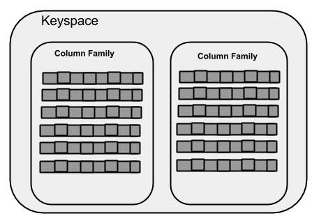
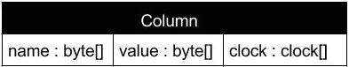
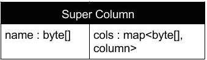

# [Apache Cassandra](http://cassandra.apache.org/doc/latest/)

## Links

- [Cassandra Docker Image](https://hub.docker.com/_/cassandra/)
- [Referenced API](https://www.tutorialspoint.com/cassandra/cassandra_referenced_api.htm)
- [Cqlsh](https://www.tutorialspoint.com/cassandra/cassandra_cqlsh.htm)
- [Shell Commands](https://www.tutorialspoint.com/cassandra/cassandra_shell_commands.htm)
- []()

## Intro

### What is Cassandra?

Cassandra is a free and open-source distributed NoSQL DBMS designed to handle large maounts of data across many commodity servers, providing high availability with no single point of failure.

### Comparing NoSQL vs. Relational Databases

| NoSQL     | SQL       |
| --------- | --------- |
| powerful query language  | very simple query language  |
| fixed schema  | no fixed schema  |
| ACID (Atomicity, Consistency, Isolation, Durability)  | "eventually consistent"  |
| transaction support  | on supported transactions  |

### Features

- **Elastic Scalability** - high scalable DBMS; allows adding more hardware to accomodate more customers and more data as per requirement
- **Always On Architecture** - since there is no single point of failure it is continuously available for business-critical applications that cannot afford failure
- **Fast Linear-Scale Performance** - throughput is increased as the number of nodes in the cluster are increased
- **Flexible Data Storage** - all possible data formats are accomodated including: structured , semi-structured and unstructured; dynamically accomodates changes to the data structure according to need
- **Easy Data Distribution** - flexibility to distribute data where needed by replicating data across multiple data centers
- **Transaction Support** - supports properties like Atomicity, Consistency, Isolation and Durability (ACID)
- **Fast Writes** - designed to run on cheap hardware, writes blazingly fast and can store hundreds of terabytes of data without sacrificing read efficiency

## Architecture

Cassandra was designed to handle big data workloads across multiple nodes without any single point of failure. Cassandra has a peer-to-peer distributed system across its nodes, and data is distributed among all the nodes in a cluster.

- All nodes play the same role; each node is independent and at the same time interconnected to other nodes.
- Each node in a cluser can accept read and write requests, regardless of where the data is actually located in the cluster.
- When a node goes down, read/write requests can be served from other nodes in the network.

### Data Replication

Cassandra uses the **Gossip Protocol** in the background to allow nodes to communicate with eachother to detect any faulty nodes in the cluster.


One or more nodes in a cluster act as replicas for a given piece of data. If nodes are detected with an out-of-date value, Cassandra returns the most recent value to the client then performs a **read repair** in the background to update the stale values.

### Components

- **Node** - the place where data is stored
- **Data Center** - a collection of related nodes
- **Cluster** - a component that contains one or more data centers
- **Commit Log** - a crash-recovery mechanism in Cassandra that logs every write operation
- **Mem-table** - a memory-resident data structure; data is first written to the commit log, then to the mem-table (there are cases where, for a single-column family, multiple mem-tables will be written)
- **SSTable** - disk file to which the data is flushed from the mem-table when its contents reach threshold value
- **Bloom Filter** - a special king of cache that is a quick, nondeterministic algorithms for testing whether an element is a member of a set; bloom filters are accessed after every query

### Cassandra Query Language

Cassandra can be accessed by its users through its nodes using Cassandra Query Language (CQL). CQL treats the database (_Keyspace_")as a container of tables. Use `cqlsh`: a prompt to work with CQL or separate application language drivers.

A Client can approach **any** node for their read-write operations. The node acts as a proxy between the client and the nodes holding the data.

#### Write Operations

- Every write activites of nodes is captured by the _commit logs_ written in the nodes.
- Later the data will be captured and stored in the _mem-table_
- When the mem-table is full, data will be written to the __SStable_ data file.

All writes are automatically partitioned and replicated throughout the cluster. Cassandra periodically consolidates the SSTables, discarding unnecessary data.

#### Read Operations

During a read operation, cassandra gets values from the mem-table and checks the bloom filter to find the appropriate SSTable holding the required data.

## Data Model

### Cluster

Being distributed over several machines that operate together, the outermost container is the _Cluster_. For failure handling, every node contains a replica, and in case of a failure, the replica takes charge. Cassandra arranges the nodes in a cluster (ring format) and assigns data to them.

#### Keyspace

The outermost container for data in Cassandra; the basic attributes of a Keyspace in Cassandra are:

- **Replication Factor** - the number of machines in the cluster that will receive copies of the same data
- **Replica Placement Strategy** - the strategy to place replicas in the ring such as:
  - **simple strategy** (rack-aware strategy)
  - **old network topology strategy** (rack-aware strategy)
  - **network topology strategy** (datacenter-shared strategy)
- **Column Families** - Keyspace is a container for a list of one or more column families; a column family is a container of a collection of rows; each row contains ordered columns; column families represent the structure of the data; each keyspace has at least one and often many column families

##### Creating a Keyspace

Syntax for creating a Keyspace:

```sql
CREATE KEYSPACE Keyspace name
WITH replication = {'class': 'SimpleStrategy', 'replication_factor': 3};
```



#### Column Family

A _column family_ is a container for an orderd collection of rows. Each row is an ordered collection of columns. The differences between a _column family_ from a table of relational databases:

| Relational Table  | Cassandra Column Family   |
| -------------     | ------------              |
| The schema in a relational model is **fixed**. Once columns are defined in a table every column in every row must be filled with at least a `null` value  | Although column families are defined, the columns are not. Columns can be freely added to any column family at any time. |
| Relational tables define only columns and the user filles in the table with values.   | A table contains columns, or can be defined as a super column family. |

Cassandra column families have the following attributes:

- **`keys_cached`** - represents the number of locations to keep cached per SSTable
- **`rows_cached`** - represents the number of rows whose entire contents will be cached in memory
- **`preload_row_Cache`** - specifies whether to pre-populate the row cache

Unlike RDBMS systems where a column family's schema is fixed, Cassandra does not force individual rows to have all the columns.


#### Column

A _column_ is the basic data struvture of Cassandra with three values, namely key or column name, value, and a time stamp.




#### SuperColumn

A super column is a special column: it is a key-value pair! Also it stores a **map of sub-columns**.



Generally column families are stored on disk in individual files. To optimize performance it is important to keep columns that are likely to query together in the same clumn family, and a super column can be helpful at implementing this.

### Data Models of Cassandra and RDBMS

Differentiating the data model of Cassandra (NoSQL) vs. an RDBMS:

| RDBMS | Cassandra |
| ----- | --------- |
| structured data | unstructured data |
| fixed schemda | flexible schema |
| a table is an array of array (ROW x COLUMN) | a table is a list of "nested key-value pairs" ( ROW x COLUMN key x COLUMN value) |
| The database is the outermost container that contains data corresponding to an application. | Keyspace is the outermost container that contains data corresponding to an application |
| tables are the entities of a database | tables or column families are the ntitity of a keyspace |
| row is an individual record in RDBMS | row is a unit of replication in Cassandra |
| column represents the attributes of a relation | column is a unit of storage in Cassandra |
| supports the concepts of foreign keys, joins | relationships are represented using collections |

## Keyspaces

### Creating a Keyspace

#### Syntax 
A keyspace is a namespace that defines data replication on nodes. A cluster contains one keyspace per node. Use `CREATE KEYSPACE` to create a keyspace. The `CREATE KEYSPACE` statement has two properties: **replication** and **durable_writes**.

```sql
CREATE KEYSPACE <identifier> WITH <properties>


CREATE KEYSPACE “KeySpace Name”
WITH replication = {'class': ‘Strategy name’, 'replication_factor' : ‘No.Of   replicas’};

CREATE KEYSPACE “KeySpace Name”
WITH replication = {'class': ‘Strategy name’, 'replication_factor' : ‘No.Of  replicas’}

AND durable_writes = ‘Boolean value’;
```

#### Replication

The `replication` option specifies the **Replica Placement Strategy** and the number of replicas wanted. This option can be used to instruct Cassandra whether to use **commitlog** for updates on the current keyspace. Option is optional and by default: `true`.

Strategies include:

| Name | Description |
| **Simple Strategy** | Specifies a simple replication factor for the cluster. |
| **Network Topology Strategy** | Using this option, you can set the replication factor for each data-center independently. |
| **Old Network Topology Strategy** | This is a legacy replication strategy. |

#### Example

- Creating a keyspace named `tutorialspoint`
- Using first replica placement strategy (simple)
- replication factor **1 replica**

```sql
CREATE KEYSPACE tutorialspoint
WITH replication = {'class':'SimpleStrategy', 'replication_factor' : 3};
```

#### Verification

Verify if a table is created or not using the command `DESCRIBE`.

If the command is applied over `keyspaces` it will display all of the keyspaces created:

```sql
DESCRIBE keyspaces

---------------------

tutorialspoint system system_traces 
```

### `durable_writes`

`durable_writes` is set to `true` by default. 